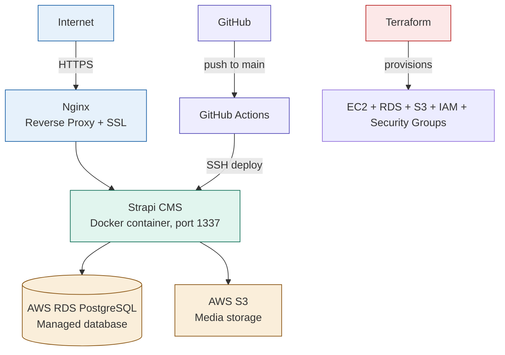

# Strapi CMS — AWS Production Deployment

A production deployment of [Strapi](https://strapi.io/) (open-source headless CMS) on AWS, using managed cloud services instead of self-managed containers — demonstrating real cloud-native infrastructure practices.

🔗 **Live instance:** [strapi.mhhuzaifa.com](https://strapi.mhhuzaifa.com)

---

## What this project demonstrates

- **AWS RDS** — managed PostgreSQL database (automated backups, patching, high availability) instead of a database Docker container
- **AWS S3** — object storage for Strapi media uploads with a custom least-privilege IAM policy
- **Terraform-provisioned infrastructure** — EC2, RDS, S3 bucket, two Security Groups, and IAM Role all provisioned as code
- **Docker Hub image registry** — pre-built image pushed to Docker Hub and pulled on the server, separating build from runtime
- **RDS Security Group isolation** — database port 5432 only accepts connections from the EC2 Security Group, never from the public internet
- **CI/CD pipeline** — GitHub Actions automatically pulls the latest image and restarts containers on push to `main`
- **Nginx + SSL** — reverse proxy with Let's Encrypt certificate, large upload support (`client_max_body_size 100M`)

---

## Architecture



---

## Infrastructure (Terraform)

All AWS resources provisioned via separate `terraform-strapi` repo:

| Resource | Details |
|---|---|
| EC2 Instance | t3.small, Amazon Linux 2023, 20GB gp3 |
| Elastic IP | Permanent static IP |
| EC2 Security Group | Ports 22, 80, 443 only |
| RDS Security Group | Port 5432 from EC2 SG only (never public) |
| RDS Instance | PostgreSQL 16, db.t3.micro, managed backups |
| S3 Bucket | Random suffix for global uniqueness |
| IAM Role + Policy | Custom policy: PutObject, GetObject, DeleteObject, ListBucket on specific bucket only |

---

## Tech Stack

- **CMS:** Strapi 5
- **Database:** AWS RDS PostgreSQL 16
- **Media Storage:** AWS S3
- **Containerization:** Docker, Docker Compose
- **Image Registry:** Docker Hub
- **Web Server:** Nginx (reverse proxy + SSL)
- **CI/CD:** GitHub Actions
- **IaC:** Terraform
- **Infrastructure:** AWS EC2
- **SSL:** Let's Encrypt (Certbot)

---

## Local Development

```bash
git clone https://github.com/mhhuzaifa223/strapi-cms-platform.git
cd strapi-cms-platform/strapi-app
npm install
npm run develop
```

App runs at `http://localhost:1337/admin`

---

## Environment Variables

Copy `.env.example` and fill in your values:

```bash
cp .env.example .env
```

Required variables:
- `APP_KEYS`, `API_TOKEN_SALT`, `ADMIN_JWT_SECRET`, `JWT_SECRET` — generate with `openssl rand -base64 32`
- `DATABASE_HOST` — RDS endpoint from Terraform output
- `DATABASE_PASSWORD` — set in `terraform.tfvars`
- `AWS_BUCKET` — S3 bucket name from Terraform output

---

## Deployment

```
git push origin main
  → GitHub Actions triggers
  → SSHes into production server
  → Pulls latest Docker image from Docker Hub
  → Restarts containers with docker compose up -d
```